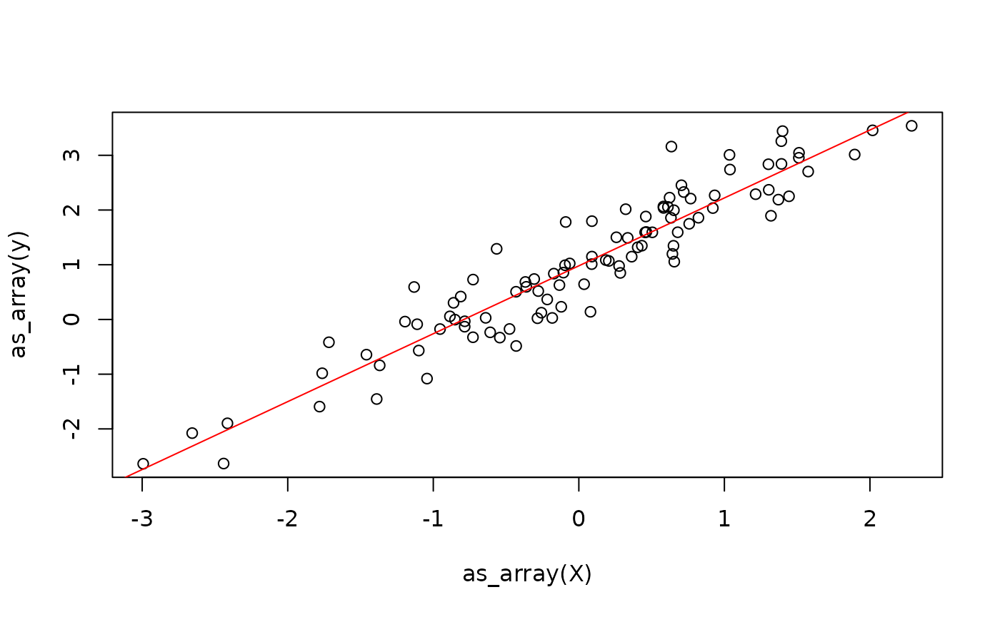

# Get Started

{anvl} is a package for writing numerical code in R that runs fast, on
the CPU or a GPU. Programs are ordinary R functions that operate on
arrays, and {anvl} adds two things on top: it can compile a function so
that it runs much faster than the R interpreter would run it, and it can
compute the gradients of a function automatically. In return, the code
has to be written in a slightly more restricted style than usual R code.
In this article, you will learn the basics by fitting a linear model. If
you have experience with JAX in Python, you should feel right at home.

## When to Use {anvl}

{anvl} is not a general replacement for base R. Every call into {anvl}
has a small fixed overhead, and a function has to be compiled before it
runs fast, which is only worth it if the work being done is large
enough. {anvl} excels at:

- Computations on large arrays, e.g. linear algebra on big matrices or
  elementwise operations on millions of values.
- Functions that are called many times with inputs of the same shape,
  such as a step of an optimization algorithm, a simulation, or an MCMC
  sampler, where the compilation cost is paid only once.
- Algorithms that need gradients, such as fitting models by gradient
  descent.
- Computations that should run on a GPU.

In contrast, base R is usually the better choice for small, one-off
computations on short vectors, where the overhead of {anvl} dominates,
and for tasks such as data wrangling, string processing, or operations
whose result size depends on the data (such as filtering), which {anvl}
does not target.

## The `AnvlArray`

The main data structure of {anvl} is the `AnvlArray`. It is essentially
like an R array, with some differences:

1.  The precision of the numbers can be chosen, e.g. 32-bit or 64-bit
    floats, and there are more integer types, such as unsigned integers.
2.  An array can live on the CPU or on a GPU, which is called its
    *device*.
3.  A scalar is an array with no axes, not a vector of length 1.

An `AnvlArray` is created from R data using
[`nv_array()`](https://r-xla.github.io/anvl/dev/reference/AnvlArray.md).
Like most functions in {anvl}, its name starts with `nv_`, which is
short for a**nv**l. Below, we create a scalar that holds a 16-bit
integer living on the CPU.

``` r

library(anvl)
set.seed(42)
nv_array(1L, dtype = "i16", device = "cpu", shape = integer())
```

    ## AnvlArray
    ##  1
    ## [ CPUi16{} ]

For scalars,
[`nv_scalar()`](https://r-xla.github.io/anvl/dev/reference/AnvlArray.md)
is a shorthand that does not require specifying the shape. The device
can also be omitted, in which case the default device is used. This is
the CPU, unless configured otherwise via the `anvl.default_device`
option.
[`with_default_device()`](https://r-xla.github.io/anvl/dev/reference/local_default_device.md)
and
[`local_default_device()`](https://r-xla.github.io/anvl/dev/reference/local_default_device.md)
change it temporarily, and
[`default_device()`](https://r-xla.github.io/anvl/dev/reference/default_device.md)
reports the current one.

``` r

x <- nv_scalar(1L, dtype = "i16")
x
```

    ## AnvlArray
    ##  1
    ## [ CPUi16{} ]

Here, we create a `2x3` array:

``` r

y <- nv_array(c(1, 2, 3, 4, 5, 6), shape = c(2, 3))
y
```

    ## AnvlArray
    ##  1 3 5
    ##  2 4 6
    ## [ CPUf32{2,3} ]

> **Terminological remark:** In {anvl}, we do not speak of the
> “dimensions” of an array, because the term is ambiguous. Instead, we
> say that `y` has two *axes*, where axis `1` has *size* 2 and axis `2`
> has size 3. The vector of axis sizes, here `c(2, 3)`, is the *shape*
> of the array.

Without a specified data type, R `double`s become `f32` (32-bit floats)
and R `integer`s become `i32`. Base R, in contrast, always computes with
64-bit doubles, so results are less precise. In exchange, computations
use half the memory and are faster, especially on GPUs. Where double
precision is needed, the default can be changed via the
`anvl.default_dtypes` option. Below,
[`with_default_dtypes()`](https://r-xla.github.io/anvl/dev/reference/local_default_dtypes.md)
changes it temporarily:

``` r

with_default_dtypes(c(float = "f64", int = "i64"), {
  print(nv_scalar(2L))
  print(nv_scalar(pi))
})
```

    ## AnvlArray
    ##  2
    ## [ CPUi64{} ] 
    ## AnvlArray
    ##  3.1416
    ## [ CPUf64{} ]

The properties of an array can be queried with getter functions:

``` r

dtype(y)
```

    ## <f32>

``` r

shape(y) # or dim()
```

    ## [1] 2 3

``` r

device(y)
```

    ## <CpuDevice(id=0)>

To continue working with the results in R, e.g. to plot them,
[`as_array()`](https://r-xla.github.io/anvl/dev/reference/as_array.md)
converts an array back to an R object. For scalars, the result is an R
vector of length 1. Because R has fewer data types than {anvl}, the
values are converted to the closest R type: floats become `double`s,
most integers become `integer`s, and integers that do not fit into an R
`integer`, such as 64-bit integers, become
[`bit64::integer64`](https://bit64.r-lib.org/reference/bit64-package.html).
See
[`?as_array`](https://r-xla.github.io/anvl/dev/reference/as_array.md)
for the full list of conversions.

``` r

as_array(y)
```

    ##      [,1] [,2] [,3]
    ## [1,]    1    3    5
    ## [2,]    2    4    6

## Computing with Arrays

Arrays are transformed with the `nv_<op>` functions, such as
[`nv_add()`](https://r-xla.github.io/anvl/dev/reference/nv_add.md) or
[`nv_matmul()`](https://r-xla.github.io/anvl/dev/reference/nv_matmul.md),
or through the usual R operators and functions like `+`, `%*%`, or
[`sum()`](https://rdrr.io/r/base/sum.html). An overview of all of them
is in the [API Functions
reference](https://r-xla.github.io/anvl/dev/reference/index.html#api-functions).

``` r

nv_add(y, x)
```

    ## AnvlArray
    ##  2 4 6
    ##  3 5 7
    ## [ CPUf32{2,3} ]

``` r

y + x
```

    ## AnvlArray
    ##  2 4 6
    ##  3 5 7
    ## [ CPUf32{2,3} ]

Let’s use this to write a function that computes the predictions of a
linear model \\y = X \beta + \alpha\\. We could also use `%*%` and `+`
here, but use the `nv_*` functions to make clear that {anvl} is doing
the work.

``` r

linear_model_r <- function(X, beta, alpha) {
  y0 <- nv_matmul(X, beta)
  nv_add(y0, alpha)
}
```

We simulate some data from a linear model and randomly initialize the
parameters that we’ll fit later.

``` r

X <- matrix(rnorm(100), ncol = 1)
beta_true <- rnorm(1)
alpha_true <- rnorm(1)
y <- X %*% beta_true + alpha_true + rnorm(100, sd = 0.5)
plot(X, y)
```


``` r

X <- nv_array(X, dtype = "f32")
y <- nv_array(y, dtype = "f32")

beta <- nv_array(rnorm(1), shape = c(1, 1), dtype = "f32")
alpha <- nv_scalar(rnorm(1), dtype = "f32")

y_hat0 <- linear_model_r(X[1:2, ], beta, alpha)
y_hat0
```

    ## AnvlArray
    ##  3.6654
    ##  1.3981
    ## [ CPUf32{2,1} ]

So far, every operation ran immediately, one after the other, just like
in normal R code. This is called *eager execution*. It is convenient for
trying things out, but it is not where {anvl}’s speed comes from.

## Just In Time Compilation

When R runs a function, it evaluates one expression at a time, and every
operation on an array is executed on its own. Each of these steps has a
small overhead, and no step knows about the others, so nothing can be
optimized across them.

[`jit()`](https://r-xla.github.io/anvl/dev/reference/jit.md) changes
this: it turns a function into a compiled program. On the first call,
{anvl} translates the whole function into a single optimized executable
and caches it. Later calls with inputs of the same shape and data type
run that executable directly, without going through the R interpreter.
This makes the first call slower, but all subsequent ones much faster.

``` r

linear_model <- jit(linear_model_r)
y_hat1 <- linear_model(X[1:2, ], beta, alpha)
all(y_hat0 == y_hat1)
```

    ## AnvlArray
    ##  1
    ## [ CPUbool{} ]

The jitted function takes the same arguments and returns the same
results[^1], so wrapping a function in
[`jit()`](https://r-xla.github.io/anvl/dev/reference/jit.md) is usually
all it takes to make it faster. The compiler behind this is
[XLA](https://openxla.org/xla), which also powers TensorFlow and JAX.

There is one rule to follow: the function should only compute its result
from its inputs, and not have side effects. See the [tracing
contract](https://r-xla.github.io/anvl/dev/articles/jit.html#the-tracing-contract)
section of the JIT deep dive for details on how to avoid unpleasent
surprises with
[`jit()`](https://r-xla.github.io/anvl/dev/reference/jit.md).

We also define a jitted function that computes the mean squared error of
the predictions:

``` r

mse <- jit(function(y_hat, y) {
  mean((y_hat - y)^2)
})

mse(linear_model(X, beta, alpha), y)
```

    ## AnvlArray
    ##  1.3679
    ## [ CPUf32{} ]

Jitted functions can be freely built out of other jitted functions.
{anvl} then compiles them together into one program.

``` r

model_loss <- jit(function(X, beta, alpha, y) {
  y_hat <- linear_model(X, beta, alpha)
  mse(y_hat, y)
})

model_loss(X, beta, alpha, y)
```

    ## AnvlArray
    ##  1.3679
    ## [ CPUf32{} ]

To learn more about how
[`jit()`](https://r-xla.github.io/anvl/dev/reference/jit.md) works, see
the [JIT Deep Dive](https://r-xla.github.io/anvl/dev/articles/jit.md)
article. For advice on when jitting pays off, see the
[Efficiency](https://r-xla.github.io/anvl/dev/articles/efficiency.md)
article.

## Automatic Differentiation

Many numerical methods, such as fitting a model by gradient descent,
need the gradient of a function. With {anvl}, it does not have to be
derived by hand:
[`gradient()`](https://r-xla.github.io/anvl/dev/reference/gradient.md)
computes it from the function itself. We use it to fit the linear model
to the data we simulated earlier – although one would usually fit a
linear model by solving the normal equations, of course.

Below, we get the gradient of `model_loss` with respect to the
parameters `beta` and `alpha`. `model_loss_grad` takes the same
arguments as `model_loss`, but returns a named list with one gradient
per parameter:

``` r

model_loss_grad <- jit(gradient(
  model_loss,
  wrt = c("beta", "alpha")
))

model_loss_grad(X, beta, alpha, y)
```

    ## $beta
    ## AnvlArray
    ##  -0.0792
    ## [ CPUf32{1,1} ] 
    ## 
    ## $alpha
    ## AnvlArray
    ##  2.1543
    ## [ CPUf32{} ]

For more on
[`gradient()`](https://r-xla.github.io/anvl/dev/reference/gradient.md),
see the [Automatic
Differentiation](https://r-xla.github.io/anvl/dev/articles/autodiff.md)
article.

Now we can write a gradient descent step that updates the parameters. We
keep them together in a `weights` list, as jitted functions can take and
return (nested) lists of arrays:

``` r

update_weights <- jit(function(X, weights, y, lr) {
  grads <- model_loss_grad(X, weights$beta, weights$alpha, y)
  list(
    beta = weights$beta - lr * grads$beta,
    alpha = weights$alpha - lr * grads$alpha
  )
})
```

Calling it repeatedly fits the model:

``` r

weights <- list(beta = beta, alpha = alpha)
lr <- 0.1
for (i in 1:100) {
  weights <- update_weights(X, weights, y, lr)
}
```



## Next Steps

For what to watch out for when writing larger programs, such as static
arguments, control flow, random numbers, and debugging, continue with
the [Next
Steps](https://r-xla.github.io/anvl/dev/articles/next_steps.md) article.

[^1]: There are some differences to base R, such as the handling of
    `NA`s or recycling; see the
    [Gotchas](https://r-xla.github.io/anvl/dev/articles/gotchas.md)
    article.
